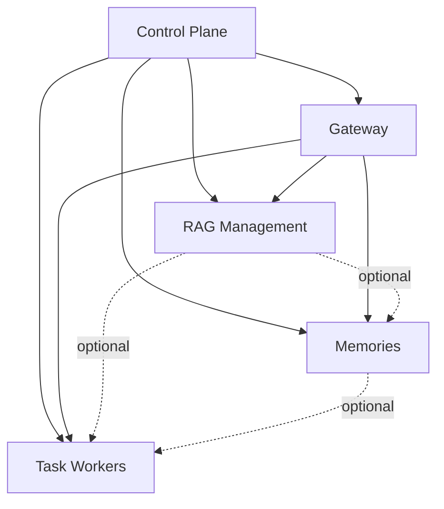

# Suite Implementation Dependency Graph & Dispatch Plan

> Companion to the 5 module plans. Defines feature-level dependencies so we can execute as many sub-agents in parallel as the DAG allows (cap: **5 in flight**).

## High-level DAG



- **Control Plane** must finish (or its public facade must exist) before any other module's services can call `require_permission`, `emit_audit`, `emit_usage`, `emit_webhook`, `is_module_enabled`.
- **Gateway facade** must exist before RAG, Memories, Workers can call LLMs/embeddings.
- RAG ↔ Memories ↔ Workers have only *soft* dependencies and can run fully in parallel once Gateway is up.

## Conflict-surface rules

Sub-agents run in **isolated git worktrees on branches off `pivot`**, merged sequentially after completion. Two agents can run in parallel safely when:

- They touch disjoint file sets (`server/api/src/ai_portal/<domain>/` directories are domain-owned)
- They author *different* Alembic revisions (each agent generates its own revision; merges produce a linear chain)
- They do not both modify `main.py` router registration in conflicting ways (use the centralized `routers.py` include list; appends are merge-safe)
- They do not both edit `pyproject.toml` for unrelated deps (additive — usually fine; agent must `uv lock` at end)

If two parallel agents *must* touch a shared file, give them **non-overlapping line ranges** in their prompts, or serialize them.

## Wave-by-wave dispatch plan

### Control Plane

**Wave CP-1 (3 agents — foundations, fully parallel)**

| Branch                       | Scope                                                | Plan Phase(s) | Deps |
| ---------------------------- | ---------------------------------------------------- | ------------- | ---- |
| `pivot-cp-tenancy`           | Orgs, Users, Memberships, Invitations                | A             | —    |
| `pivot-cp-blobstore`         | BlobStore protocol + 5 providers                     | J             | —    |
| `pivot-cp-notify-core`       | Notification protocol + smtp + in_app channels       | I1            | —    |

→ Merge in order: tenancy → blobstore → notify-core. None conflict.

**Wave CP-2 (5 agents — built on Wave 1)**

| Branch                       | Scope                                                | Plan Phase(s) | Deps               |
| ---------------------------- | ---------------------------------------------------- | ------------- | ------------------ |
| `pivot-cp-rbac`              | Permission catalog + roles + assignments + deps      | B             | tenancy            |
| `pivot-cp-audit`             | Audit hash chain + sinks + search/export endpoints   | D             | tenancy            |
| `pivot-cp-usage`             | Usage events + rollups + quotas + budgets            | E             | tenancy            |
| `pivot-cp-webhooks`          | Webhook model + signer + delivery worker + emit      | F             | tenancy            |
| `pivot-cp-notify-channels`   | SES + SendGrid + Slack + user pref matrix            | I2 + I3       | notify-core, tenancy |

**Wave CP-3 (5 agents)**

| Branch                       | Scope                                                | Plan Phase(s) | Deps              |
| ---------------------------- | ---------------------------------------------------- | ------------- | ----------------- |
| `pivot-cp-api-keys`          | API keys + bearer strategy                           | C             | tenancy, rbac     |
| `pivot-cp-idp-core`          | IdP protocol + OIDC + SAML                           | G1, G2, G3    | tenancy, rbac     |
| `pivot-cp-settings`          | Org settings KV + module flags                       | L             | tenancy           |
| `pivot-cp-security`          | TOTP MFA + session listing + brute-force limiter     | M             | tenancy           |
| `pivot-cp-billing`           | Billing protocol + manual + Stripe + router          | K             | tenancy, blobstore |

**Wave CP-4 (4 agents)**

| Branch                       | Scope                                                | Plan Phase(s) | Deps                       |
| ---------------------------- | ---------------------------------------------------- | ------------- | -------------------------- |
| `pivot-cp-sso`               | Entra/Okta/Google presets + SSO routes + JIT + required | G4-G6     | idp-core, settings         |
| `pivot-cp-scim`              | SCIM 2.0 router + tokens + Okta/Entra presets        | H             | tenancy, rbac, api-keys    |
| `pivot-cp-gdpr`              | Data export + delete jobs + cascade registry         | N             | blobstore, notify, audit, usage, webhooks (all)    |
| `pivot-cp-admin-ui-1`        | Admin shell + Members + Audit viewer + Usage charts  | O1-O5         | rbac, audit, usage         |

**Wave CP-5 (3 agents — finish)**

| Branch                       | Scope                                                | Plan Phase(s) | Deps |
| ---------------------------- | ---------------------------------------------------- | ------------- | ---- |
| `pivot-cp-admin-ui-2`        | Admin remaining pages (Billing, Webhooks, SSO/SCIM config, Settings, Data) | O6-O10 | all CP backend |
| `pivot-cp-facade`            | `control_plane/__init__.py` public re-exports + tests | P            | all CP |
| `pivot-cp-integrate-chat`    | Wire existing chat to use control_plane.emit_*       | (cross-cut)   | facade |

### Gateway

Starts only after **`pivot-cp-facade`** is merged.

**Wave GW-1 (5 agents)**

| Branch                       | Scope                                                | Plan Phase(s) | Deps          |
| ---------------------------- | ---------------------------------------------------- | ------------- | ------------- |
| `pivot-gw-canonical`         | LLMRequest/Response types + protocol refactor + existing-provider adapt | A1, A2 | cp-facade |
| `pivot-gw-catalog`           | Model catalog table + sync + encrypted provider credentials | A3, A4   | cp-facade |
| `pivot-gw-cache`             | Cache protocol + 3 backends                          | E1            | cp-facade     |
| `pivot-gw-rate-limits`       | Rate limit rules + buckets + /limits/me              | D             | cp-facade     |
| `pivot-gw-traces-core`       | request_traces table + writer + OTEL                 | H1, H2        | cp-facade     |

**Wave GW-2 (5 agents — compat surfaces)**

| Branch                       | Scope                                                | Plan Phase(s) | Deps              |
| ---------------------------- | ---------------------------------------------------- | ------------- | ----------------- |
| `pivot-gw-openai`            | OpenAI Chat Completions + Embeddings                 | B1, B2        | gw-canonical, catalog, traces |
| `pivot-gw-anthropic`         | Anthropic Messages + count_tokens                    | B3            | gw-canonical      |
| `pivot-gw-bedrock`           | Bedrock Converse + Converse-stream                   | B4            | gw-canonical      |
| `pivot-gw-aux-endpoints`     | /v1/models + /v1/rerank + /v1/moderations            | B5, B6        | catalog           |
| `pivot-gw-routing`           | 7 routing strategies + failover + circuit-breaker + alias | C        | gw-canonical, catalog |

**Wave GW-3 (5 agents)**

| Branch                       | Scope                                                | Plan Phase(s) | Deps         |
| ---------------------------- | ---------------------------------------------------- | ------------- | ------------ |
| `pivot-gw-guardrails-1`      | Protocol + bundles + regex + presidio + secret-scanner | F1, F2     | cp-facade    |
| `pivot-gw-guardrails-2`      | Prompt-injection + moderation (OpenAI mod + LlamaGuard) | F3, F4    | guardrails-1, OpenAI compat |
| `pivot-gw-guardrails-3`      | Schema validator + topic filter + custom + policy resolution | F5, F6 | guardrails-1 |
| `pivot-gw-cost-budget`       | Cost calc + pre-call budget cutoff + cache integration | G1, G2, E2, E3 | cp-budgets, catalog |
| `pivot-gw-traces-api`        | Traces search + replay endpoints                     | H3            | traces-core, openai |

**Wave GW-4 (4 agents)**

| Branch                       | Scope                                                | Plan Phase(s) | Deps          |
| ---------------------------- | ---------------------------------------------------- | ------------- | ------------- |
| `pivot-gw-playground-eval`   | Playground + Eval framework                          | I1, I2        | openai/anthropic |
| `pivot-gw-ui-1`              | Frontend: Overview + Providers + Models + Routing + Rate Limits | J1-J5 | all GW backend |
| `pivot-gw-ui-2`              | Frontend: Guardrails + Traces + Playground + Evals + Snippets | J6-J10 | all GW backend |
| `pivot-gw-facade`            | Internal facade + chat integration                   | K1, K2        | all GW |

### Peer modules (RAG / Memories / Task Workers)

Start only after **`pivot-gw-facade`** is merged. They run **in parallel** as 5 agents.

**Wave PM-1 (5 agents — module foundations)**

| Branch                       | Scope                                                | Plan Phase(s) | Deps             |
| ---------------------------- | ---------------------------------------------------- | ------------- | ---------------- |
| `pivot-rag-core`             | KB CRUD + documents + per-KB key + vector backends + chunkers + extractors framework | RAG A-D | gw-facade |
| `pivot-rag-connectors-1`     | Connector framework + web-crawler + file-upload + S3/Azure/GCS + GDrive + OneDrive/Sharepoint | RAG connectors batch | rag-core |
| `pivot-mem-core`             | Memories model + extractors + recallers + stores + policies | MEM A-E | gw-facade |
| `pivot-workers-core`         | Worker types + protocols + fake-sandbox + pools + lifecycle state machine | WRK A-B | gw-facade |
| `pivot-workers-tools`        | Tool registry + shell/file/code_search/quality/git tools | WRK F (subset) | workers-core |

**Wave PM-2 (5 agents)**

| Branch                       | Scope                                                | Plan Phase(s) | Deps |
| ---------------------------- | ---------------------------------------------------- | ------------- | ---- |
| `pivot-rag-connectors-2`     | Confluence + Notion + Slack + Github + Gitlab + IMAP + Salesforce + Zendesk + Jira + generic-HTTP | RAG remaining connectors | rag-core |
| `pivot-rag-pipeline-acl`     | 8-stage pipeline runner + ACL mirror + permission-test | RAG ingestion phases | rag-core |
| `pivot-rag-search-answer`    | Hybrid search + RRF + rerank + 6 search providers + answer w/ citations | RAG search/answer phases | rag-core |
| `pivot-mem-integrations`     | Chat + assistants + workers + RAG memory.search integrations + analytics + admin | MEM remaining | mem-core, rag-core |
| `pivot-workers-sandboxes-providers` | docker + k8s + firecracker stubs; github + gitlab + bitbucket + gitea + azure_devops; jira + linear + github_issues + gitlab_issues + azure_boards triggers | WRK sandbox/git/tracker phases | workers-core |

**Wave PM-3 (5 agents)**

| Branch                       | Scope                                                | Plan Phase(s) | Deps |
| ---------------------------- | ---------------------------------------------------- | ------------- | ---- |
| `pivot-rag-eval-playground-ui` | Eval framework + chat playground + analytics + 12 UI pages | RAG eval+UI | rag-core + search/answer |
| `pivot-mem-ui`               | My Memories + Shared + Settings + Chat sidebar + Admin pages | MEM UI | mem-core |
| `pivot-workers-agent-loops`  | ReAct + plan_and_execute + openhands_style + AGENTS.md loader + pkg-manager detect | WRK agent loops | workers-core + tools |
| `pivot-workers-governance`   | Secrets + egress + approvals + cost+budget + audit hooks + trace correlation | WRK governance | workers-core |
| `pivot-workers-ui-streaming` | SSE event stream + Tasks UI + live view + 13 pages | WRK UI | workers-core + tools + agent-loops |

### Final wave (1 agent)

| Branch                       | Scope                                                |
| ---------------------------- | ---------------------------------------------------- |
| `pivot-e2e-verification`     | Write + run cross-module E2E suite (per CLAUDE.md): SSO+invite+key+audit+budget flow; gateway routes-to-provider; KB ingest+answer; memory recall in chat; worker task → PR. Set up E2E DB per worktree port assignment. |

## Per-wave throughput estimate

- Each agent runs in its own worktree, fresh Postgres containers via `./scripts/worktree-up.sh`
- File-scoped pytest only during agent work
- Mean agent runtime: 60–180 minutes
- 5-wide bandwidth: ~5 agents × 120 min = ~10 hours of wall clock for ~25 agent-hours of work

## Merge protocol (orchestrator)

1. When an agent completes, fetch the worktree's branch
2. Rebase onto current `pivot` (linear history, alembic revisions ordered)
3. Run `pytest <only files changed in that branch>` on the rebased state
4. If green → fast-forward merge to `pivot`
5. If conflicts → fix on rebase or send back to the agent via SendMessage with the diff
6. Tear down the worktree: `./scripts/worktree-down.sh <name>`

## Notes on `pyproject.toml`

- Each agent that adds deps appends to `[project.dependencies]` in its own branch
- Merge will textually conflict — orchestrator must rebase and reconcile
- After all merges of a wave, run `uv lock` once and commit the lockfile

## Notes on Alembic

- Each agent creates `alembic revision -m "<module>: <feature>"` autogen=false
- Revisions linearize at merge by `down_revision` re-pointing during rebase
- Orchestrator must ensure `alembic upgrade head` from empty works post-merge

## Hard order summary

```
CP-1 → CP-2 → CP-3 → CP-4 → CP-5 (facade)
                                ↓
              GW-1 → GW-2 → GW-3 → GW-4 (facade)
                                          ↓
                            PM-1 → PM-2 → PM-3
                                          ↓
                                     Final E2E
```

Total: **5 sequential waves of CP + 4 of GW + 3 of PM + 1 final = 13 waves**, **52 agents** total, each touching a bounded scope.
