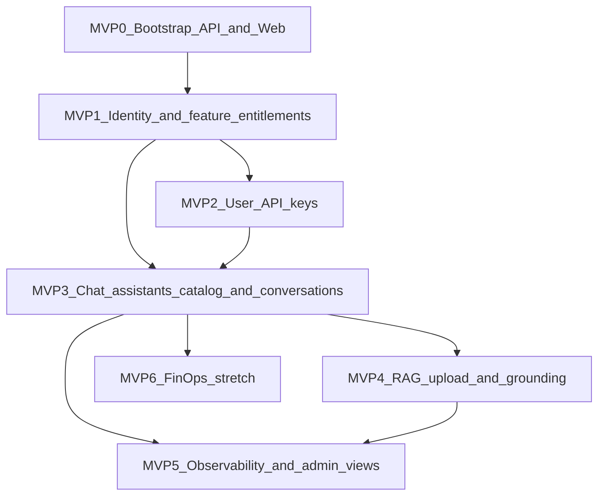

# AI Portal — specification index (root)

This folder holds **feature design specs**, created **lazily** as work starts. This file is the **single backlog registry**: capabilities, priority, dependencies, and links to specs/plans when they exist.

**Related:** [MVP implementation plan (monolith draft)](../plans/2026-03-21-ai-portal-mvp-implementation.md) — full chunk map + syllabus. **[MVP-0 bootstrap plan](../plans/2026-03-21-mvp-0-bootstrap.md)** — implement first. Prefer **one `writing-plans` doc per vertical EPIC** once the matching spec is approved.

---

## Implementation snapshot (vs brainstorm / registry)

This section records **what the repository actually contains today** so the capability registry and older plans do not read as “nothing shipped.” Individual specs may still say `spec-draft` for product depth; **code is ahead of several MVP rows** below.

### Shipped or largely present

- **Scaffold & local infra (MVP-0, F-01–F-04):** FastAPI + TanStack Start, Docker Compose (`local-dev`, Postgres **pgvector** + Redis on **5434** / **6380**), CI, `/health`, CORS, `X-Request-ID`, structured logging.
- **Identity (MVP-1 core):** `AUTH_MODE=dev` (fixed bearer + seed user) or **`AUTH_MODE=entra`** (JWT validation, app roles on `request.state`, profile upsert). **Portal API keys** (`aip_…`): create/list/revoke on **`/api/me/portal-api-keys`** (no dedicated settings UI in the web app yet—API-first).
- **RBAC helper:** `api/rbac.require_app_roles` (e.g. `/api/admin/ping`); dev mode bypasses role checks.
- **Model catalog (REQ-META thin slice):** `GET /api/model-catalog` + `catalog_models` seed; chat UI selects models.
- **Assistants + conversations (MVP-3):** Assistant CRUD/list; conversation CRUD; **streaming chat** via **LangChain** (`ChatOpenAI` / `ChatAnthropic`); optional **`use_rag`** with KBs attached per conversation; **conversation summary** + sliding window (`workers/memory/summarizer.py`).
- **RAG / knowledge bases (MVP-4 core):** KB CRUD, document upload, **inline ingest** on the API thread (`workers/ingest/*` from `api/knowledge_bases.py`—not Celery), pgvector retrieval (`services/rag.py`), frontend routes `/knowledge-bases`, chat KB picker.
- **User memories:** Profile memories API (`api/memories.py`), `/memories` UI, background extraction (`workers/memory/extractor.py`) — [memory system spec](./2026-03-31-memory-system-design.md).

### Not shipped / still backlog (or diverges from early plans)

- **Celery (or other) async ingest queue** — plans assumed Redis workers; Redis is wired for local dev but ingest is **synchronous** on the request path (see [RAG enterprise spec](./2026-03-25-rag-enterprise-design.md) §3).
- **LiteLLM** as the primary model gateway — runtime is **LangChain → provider APIs** (OpenAI-compatible + Anthropic); no LiteLLM sidecar in the default compose profile.
- **Central I-08 entitlements** gating product features in UI and on every API (roles exist; feature flags / SKU matrix not productized).
- **MVP-2 “my keys” UX** — parity with API: no in-app panel for portal keys yet.
- **MVP-5 / MVP-6:** Full observability dashboards (O-02), admin console depth, FinOps budgets, hybrid search / rerank / citations UX, guardrails product (**GR-**), external connectors (**R-06**), OCR (**R-05**), etc.

---

## Principles

- **Root = source of truth for scope and priority.** Feature specs add detail when that row moves toward implementation.
- **Vertical slices (full stack):** For each **major feature**, implement **backend + frontend together** in the same delivery slice—shared contracts (OpenAPI or typed client), minimal “API-only” phases that leave UI far behind. Early **MVP-0** bootstraps **both** apps so every later EPIC can ship a thin UI alongside API behavior.
- **Backlog shape:** Hierarchy is **Scope → EPIC → ticket**. A **scope** is a product/domain bucket (e.g. **Guardrails**, **MVP-3 Chat**); each scope holds **EPICs**; each EPIC is one **vertical feature** when work starts. Tickets inside an EPIC break down work (**e.g.** contract, API, UI, tests). Parallel work: assign **different EPICs** (or scopes), not half of the same slice without coordination.
- **Quick wins first:** smallest end-to-end path that proves deploy + auth + **pick an assistant and chat**, then deepen (RAG, FinOps, etc.).
- **Specs naming (when created):** `YYYY-MM-DD-<short-slug>-design.md`.

### Status legend

| Status | Meaning |
|--------|---------|
| `backlog` | Listed here only; no spec file yet |
| `spec-draft` | Design doc exists; not final |
| `spec-approved` | Ready for `writing-plans` + delivery EPICs |
| `in-progress` | Implementation underway |
| `done` | Shipped for current scope |

### Feature specs (this folder)

| Document | Status | Notes |
|----------|--------|--------|
| [2026-03-22-auth-entra-design.md](./2026-03-22-auth-entra-design.md) | spec-approved | **Implemented in code:** `AUTH_MODE=entra` + dev bearer mode; JWT validation, app roles, `/api/me`. **I-06** worker client-credentials and full I-08 entitlements payload — partial vs spec. Plan: [../plans/2026-03-22-auth-entra.md](../plans/2026-03-22-auth-entra.md) |
| [2026-03-22-chat-conversations-design.md](./2026-03-22-chat-conversations-design.md) | spec-draft | **Core shipped:** conversations + streaming (`api/conversations.py`), model picker, assistants, KB attach + RAG flag. **Deferred / partial:** chat attachments (**C-04**), syllabus, and spec polish |
| [2026-03-22-llm-access-model-governance-design.md](./2026-03-22-llm-access-model-governance-design.md) | spec-draft | **LLM access & governance:** in-process LiteLLM (no proxy as primary path), portal-owned catalog/entitlements, OIDC + portal API keys (`aip_…`), RAG boundaries |
| [2026-03-22-model-platform-requirements.md](./2026-03-22-model-platform-requirements.md) | spec-draft | **Delivery spec:** baseline + tasks; **REQ-META** (metadata in DB + APIs); appendix **REQ-*** — [LLM governance design](./2026-03-22-llm-access-model-governance-design.md) |
| [2026-03-25-rag-enterprise-design.md](./2026-03-25-rag-enterprise-design.md) | spec-draft | **MVP-4 / R-01–R-08:** RAG depth for enterprises — **as-implemented** sections match repo (inline ingest, KB UI, no `api/chat.py`). Enterprise targets still backlog |
| [2026-03-31-memory-system-design.md](./2026-03-31-memory-system-design.md) | approved / implemented | User profile memories + conversation summarization; plan: [../plans/2026-03-31-memory-system-plan.md](../plans/2026-03-31-memory-system-plan.md) |
| [2026-03-31-rag-toolcall-ingest-retrieval-design.md](./2026-03-31-rag-toolcall-ingest-retrieval-design.md) | approved (partial) | **In code:** tool-based `search_knowledge_base` streaming path in `api/conversations.py`. **Still open vs spec:** async ingest queue, hybrid search, Voyage rerank, full decoupling described in the doc |
| [Worktree merge order (Entra → chat)](../plans/2026-03-22-git-worktree-merge-order.md) | plan | Historical merge guidance; **Epic 10** before **epic 11**; paths `.worktrees/entra-auth-mvp`, `.worktrees/chat-post-auth` |

### Registry integrity (feature specs ↔ MVP rows)

- **MVP-3 “catalog + chat”** vs **conversations-first chat spec:** the repo shipped **conversations + streaming + assistants + model catalog** together; the chat spec remains **spec-draft** for attachments (**C-04**), syllabus, and other polish.
- **MVP-1 I-08 entitlements:** the [auth-entra spec](./2026-03-22-auth-entra-design.md) is **implementable without** full **I-08** — current code has roles and admin probe routes but **not** a centralized entitlements matrix on every feature.

---

## Platform assumptions (current)

| Topic | Decision |
|--------|-----------|
| **Cloud (now)** | **Microsoft Azure** for hosted infra (containers, managed data stores, secrets, networking). Keep app logic portable where reasonable. |
| **Models (now)** | **LangChain** in the API to **OpenAI-compatible** chat/embeddings and **Anthropic** chat (`OPENAI_API_BASE` / `OPENAI_API_KEY`, `ANTHROPIC_API_KEY`). **Embeddings:** **Voyage** when `VOYAGE_API_KEY` is set (default `voyage-4-lite`), else OpenAI-compatible embeddings via LangChain. Azure OpenAI remains a **deployment choice** (point `OPENAI_API_BASE` at the Azure endpoint). Provider-specific adapters can still expand (Gemini, local vLLM, etc.). |
| **Auth — identity** | **Multiple connectors** to customer IdPs (OIDC/OAuth2 primary; SAML optional). **First concrete slice:** [Microsoft Entra](./2026-03-22-auth-entra-design.md) (single tenant, SPA + API JWT); additional providers later under **I-01**. |
| **Principal model** | Treat **tenant**, **workspace** (when introduced), **user**, **service account**, and **API key** as explicit first-class subjects. Ownership, access checks, budgets, and audit should always resolve against this model rather than ad hoc per feature. |
| **Auth — AI usage** | **API key manager per user** (and later team/workspace) for **model API** access—separate from SSO identity; supports CLI, IDE, and automation. |
| **Auth — feature access** | **Entitlements / allowances:** which **product features** a principal may use (e.g. RAG upload, pipeline builder, external API, FinOps dashboards). Sourced from **roles, groups, IdP claims, plan/license**, and **admin overrides**; enforced on **every API** and reflected in the **UI** (hide/disable, clear 403, upgrade hints)—same rules everywhere. |
| **Performance — tokens** | **Token usage is a first-class cost and latency driver.** The platform should **default to efficient** context (prompt + completion) and expose **tuning** to admins/builders; see **M-06** for concrete practices. |

---

## Vertical slice — phase map

Each phase is a **shippable column**: API + UI (even if minimal) for that theme. Dependencies flow downward.

---

## Major capabilities catalog

Stable IDs for the **whole product surface** (MVP + growth). Use these in specs, plans, and backlog labels (e.g. capability IDs on work items). **Guardrails** use IDs `GR-01` … `GR-06` (dedicated subsection). Not all are MVP; order is **not** strict below—see **MVP vertical registry** for build sequence.

### Foundation & delivery

| ID | Capability | Description |
|----|------------|-------------|
| **F-01** | **Monorepo & dev experience** | Single repo (or clearly linked packages) with consistent lint/format/test; local dev that matches cloud; optional shared OpenAPI → typed client generation so FE/BE stay in sync vertically. |
| **F-02** | **Container images & runtime** | Production-oriented Dockerfiles for API and web; non-root users; health endpoints; configurable via env; ready for Azure Container Apps / AKS / App Service. |
| **F-03** | **CI/CD pipelines** | Build, test, security scan, publish artifacts, deploy to **dev / staging / prod**; database migrations as gated steps; rollback strategy. |
| **F-04** | **Configuration & secrets** | Layered config (defaults → env → Key Vault references); no secrets in client bundles; rotation-friendly patterns on Azure. |
| **F-05** | **Infrastructure as code** | Bicep/Terraform (or equivalent) for Azure resources: networking, databases, identity integration hooks, storage—reproducible environments. |

### Identity, access & API keys

| ID | Capability | Description |
|----|------------|-------------|
| **I-01** | **OIDC / OAuth2 connector framework** | Register one or more IdPs per deployment; standard flows (auth code + PKCE); map claims to internal user profile and groups; validate **Bearer JWTs** on the API (first slice: [Microsoft Entra](./2026-03-22-auth-entra-design.md)); optional cookie/BFF later. |
| **I-02** | **SAML / enterprise SSO (optional connector)** | For customers requiring SAML; same internal user model as OIDC; often phased after OIDC. |
| **I-03** | **User profile & directory sync** | Link external Id to internal user; optional SCIM or batch sync for large orgs; display name, email, group membership cache. |
| **I-04** | **Roles, groups & RBAC** | Admin / builder / consumer (and extensions); enforce on API routes and UI routes; seed roles for dev. Often **feeds** feature entitlements (**I-08**) but is not the only source. |
| **I-05** | **Per-user API keys** | Create, list, revoke, rotate keys; hash at rest; scope keys to model/chat endpoints; audit last-used; UI panel + API for power users. |
| **I-06** | **Service accounts / machine identity** | Non-human principals for integrations; separate from personal keys; often tied to workspace later. |
| **I-07** | **Fine-grained ABAC / resource policies** | Tag assistants and KBs with sensitivity; policies like “only HR group sees HR assistants”; phased after RBAC. |
| **I-08** | **Feature entitlements & allowances** | Central model of **which product capabilities** are on for a user, group, workspace, or tenant (e.g. `rag`, `api_keys`, `prompt_enhancer`, `rag_pipeline_canvas`, `agent_pipeline_canvas`, `orchestration_loop_critic`, `orchestration_coordinator`, `orchestration_agent_as_tool`, `external_api`, `mcp_tools`, `guardrails_prompt_injection`, `guardrails_pii`, `guardrails_secrets`, `guardrails_custom_rules`, `guardrails_attachments_policy`, `guardrails_moderation`). Resolved from **RBAC + IdP claims + plan/license + overrides**; exposed as a **claims/entitlements** payload after login for the UI; checked on **every** privileged API (403 + machine-readable reason). Include an **admin policy simulator / entitlement debugger** so support and admins can answer “why can this principal do this?” without tracing raw rules by hand. Supports **gradual rollout** and **tenant SKUs** without forking code. |

### Portal UX & change management

| ID | Capability | Description |
|----|------------|-------------|
| **U-01** | **App shell & navigation** | Layout, nav, responsive behavior, theming; accessible components; matches org branding hooks. |
| **U-02** | **Onboarding & first-run** | Welcome flow, policy acknowledgement, “what you can do here”; reduces support load. |
| **U-03** | **In-app help, FAQ & docs links** | Curated FAQ (not RAG); links to training, acceptable use, privacy; searchable help center optional. |
| **U-04** | **Training & enablement surfaces** | Embed or link webinars, courses, release notes; optional completion tracking. |
| **U-05** | **Feedback & support entry points** | “Report a problem,” link to ticketing; capture context (route, assistant id) for L2. |

### Authoring “sugar” (prompt UX)

Optional **quality-of-life** features for builders and power users; gate via **I-08** if some tiers should not get AI-assisted editing.

| ID | Capability | Description |
|----|------------|-------------|
| **S-01** | **Prompt builder** | Guided **templates** (roles, tasks, constraints), **variables** / slots, sectioned layout, and **live preview** against a chosen model—reduces blank-page friction without hiding the raw system prompt. |
| **S-02** | **Prompt enhancer** | **AI-assisted** actions on a draft (clarify, expand, shorten, change tone, add safety constraints) with **policy** (no exfiltration, audit log, optional “human must approve” for prod assistants). Distinct from free-form chat: scoped tool with traceability. |
| **S-03** | **Prompt library & snippets** | Reusable org snippets, versioning, sharing by group; inject into **A-02** / chat. |

### Chat & assistants (catalog is part of chat)

Assistants are **what you chat with**; the **catalog** is the **entry surface** (pick or manage an assistant), not a separate product area. **Target:** IDs **A-*** and **C-*** in one vertical slice; **conversations-first** delivery ([chat spec](./2026-03-22-chat-conversations-design.md)) may ship **C-01–C-04** before **A-01–A-03**.

| ID | Capability | Description |
|----|------------|-------------|
| **A-01** | **Assistant registry & metadata** | Name, description, owner, visibility, tags, lifecycle (draft / published / deprecated)—the rows users see before opening a thread. |
| **A-02** | **Assistant CRUD (builder flow)** | Create/edit system prompts, default model params, tool bindings; validation and preview; same slice as chat so builders immediately try the assistant. |
| **A-03** | **Entitlements & catalog visibility** | Who sees which assistant; RBAC + assistant-level ACL enforced on **list, detail, and chat** consistently. |
| **C-01** | **Conversational chat UI** | Message list, streaming responses, stop/regenerate, markdown/code rendering; entry from **assistant catalog** when present, or from **app chat shell** when [conversations ship first](./2026-03-22-chat-conversations-design.md). |
| **C-02** | **Conversation persistence** | Persist **conversations** (threads) per user; resume later; optional titling and archive. When assistants exist, scope may include **per-assistant** threads; [conversations-first](./2026-03-22-chat-conversations-design.md) uses **user-owned conversations** without requiring a catalog row v1. |
| **C-03** | **Multi-turn context & limits** | Context window strategy, summarization hooks; clear errors when limits exceeded. Implements **conversation-side** controls aligned with **M-06** (e.g. last-K turns, summary buffer, max completion tokens). |
| **C-04** | **Attachments in chat (optional)** | User uploads for one-off context (distinct from long-term RAG corpus). |
| **A-04** | **Versioning & publish workflow** | Version history, diff, rollback; optional approval before publish for regulated orgs. |
| **A-05** | **Assistant templates / clones** | Start from org-approved templates; clone for experimentation. |

### Models, routing & FinOps

| ID | Capability | Description |
|----|------------|-------------|
| **M-01** | **Model provider abstraction** | **Internal interface** for chat completions, streaming, and **embeddings** (RAG). **First implementation: Azure OpenAI**; additional **provider adapters** (e.g. **Anthropic** Messages API, OpenAI SDK, Gemini, local/vLLM) plug in behind the same contract. Normalize **model IDs** (portal “logical” model → provider deployment name), **auth** (API key / managed identity / per-tenant secret), **timeouts/retries**, and **token usage** at this layer so upper layers stay provider-agnostic. |
| **M-02** | **Model catalog & allowlists** | Which models exist per environment; hide experimental models in prod; admin UI. |
| **M-03** | **Usage metering** | Tokens, requests, latency per user/team/key; persist for billing and capacity planning. Prefer **per-step / per-hop** breakdown (chat turn, RAG inject, tool call, orchestration node) so teams can see **where** tokens go—feeds **M-06** tuning. |
| **M-04** | **Budgets, quotas & rate limits** | Soft/hard caps; 429 behavior; admin override; alerts (email/webhook). |
| **M-05** | **Routing, fallbacks & resilience** | Model fallback chains; circuit breaking; degraded-mode messaging. Prefer **cheaper / smaller** models for **routing, classification, critique** when quality allows; reserve **largest** model for final user-facing generation. |
| **M-06** | **Token efficiency & context discipline** | **Best practices baked into product defaults and builder UX:** (1) **Lean prompts** — no duplicate system text across turns; templates with shared blocks. (2) **Conversation state** — rolling **summary** + last-**K** turns; trim or omit stale **tool/MCP** payloads from context. (3) **RAG** — cap **top-k** and **chars** injected; **rerank** to avoid over-stuffing; optional skip-generation when retrieval confidence is low (**R-04**). (4) **Tools** — **truncate/summarize** large tool results before the next LLM call; schema-first outputs. (5) **Output** — org/assistant **max completion tokens** and **concise** style presets (**C-03**). (6) **Graphs** — **G-06**/**R-08**: hard **max loop iterations**, avoid redundant parallel LLM nodes. (7) **Caching** — optional **safe** cache (prompt+params hash, TTL, tenant isolation) where policy allows; never cache sensitive streams without approval. (8) **Structured outputs** when they reduce repair turns. |

### RAG & knowledge

| ID | Capability | Description |
|----|------------|-------------|
| **R-01** | **Knowledge base binding** | Associate corpus with assistant; multiple KBs per assistant optional later. |
| **R-02** | **Document upload & storage** | Secure upload; virus scan hook; store in Azure Blob or equivalent; access aligned to assistant ACL. |
| **R-03** | **Ingestion pipeline** | Extract text, chunk, embed, index; async jobs (queue worker); status and error reporting in UI. |
| **R-04** | **Vector search & retrieval** | pgvector (or managed search); top-k; filter by permission; inject into prompt with citations. |
| **R-05** | **OCR & rich documents** | PDFs, scans, slides, tables; quality flags and quarantine for failures. |
| **R-06** | **Connectors (SharePoint, S3, URLs)** | Pull or sync content on a schedule; incremental updates. |
| **R-07** | **Evaluation & quality (RAGAS, golden sets, regression suites)** | Use **RAGAS** for retrieval/answer quality where it fits, but broaden evaluation beyond pure RAG: offline eval in CI, golden sets, prompt/assistant regression suites, side-by-side comparisons, and release gates for major changes. Human feedback loop optional. |
| **R-08** | **Visual RAG pipeline builder** | **Canvas / node-based editor** to compose **data/knowledge pipelines**: sources → parse/OCR → chunk → embed → index → (optional) retrieve/rerank—serialized to a **versioned recipe** the worker executes. Include **control-flow** where useful: **branches** (e.g. by file type), **retry / loop** on failure or until a **quality gate** passes, optional **LLM-as-step** (e.g. doc classification). **Multi-agent orchestration** (coordinator, critic loops, agent-as-tool) is centered in **G-06**; R-08 reuses the **same canvas UX** but optimized for **ingestion/retrieval**. Pair with **wizard presets** for beginners. UX inspiration: [YouTube reference (pipeline / graph UI)](https://www.youtube.com/watch?v=89KKm_a4M7A). |

### Guardrails & LLM policy (input/output)

First-class product capabilities for **safe, compliant** use of models—**before and after** the LLM call. Detailed breakdown of what was previously folded into **G-04** / **G-05**. External benchmark (not a dependency): [LLM Gateway — Guardrails](https://llmgateway.io/features/guardrails).

**What guardrails cover (product themes):**

| Theme | Role |
|-------|------|
| **Prompt injection protection** | Detect and block attempts to **manipulate** the application through malicious user content—e.g. overriding system instructions, abusing tools, classic jailbreak phrasing. Implemented as **GR-01** with policy per assistant/tenant and audit (**V-01**). |
| **PII detection & redaction** | Find **personal/sensitive** data in prompts and adjacent context **before** it reaches external LLMs; **redact**, **block**, or **route** to approved models/regions. Supports compliance positioning with **V-01–V-04**. **GR-02**. |
| **Secrets detection** | Prevent **API keys, passwords, tokens** (and similar) from being sent in prompts or leaked in logs; warn users and block or quarantine. Complements **I-05**; focuses on **accidental exfiltration**. **GR-03**. |
| **Custom rules engine** | Tenant-defined **blocked terms**, **regex**, **topic allow/deny**, and related policy; optional per-assistant overrides; **versioned** rules for audit. **GR-04**. |
| **File & attachment handling** | Policy for what **uploads** and **files** may enter model context vs stay out (types, size, scanning)—aligned with chat attachments (**C-04**) and RAG ingestion (**R-02**). **GR-05**. |
| **Moderation & topic bounds** | Provider moderation plus **local** rules; enforce **topic boundaries** for the product; log hits and optional **X-03** webhooks. **GR-06**. |

**Typical use cases**

- **Data privacy compliance** — Reduce risk of sending regulated personal data to third-party models; evidence for GDPR/CCPA-style programs when combined with governance **V-02**/**V-03** (retention, residency, classification).
- **Security hardening** — Cut prompt-injection and jailbreak surface; reduce leakage of secrets pasted into chat.
- **Content moderation** — Keep disallowed topics and unsafe content out of user-visible outputs and off-brand use cases.

| ID | Capability | Description |
|----|------------|-------------|
| **GR-01** | **Prompt injection & jailbreak protection** | Detect and block attempts to manipulate the app via malicious user content (system prompt override, tool abuse, “ignore previous” patterns). Policy per assistant/tenant; audit hits (**V-01**). |
| **GR-02** | **PII detection & redaction** | Identify sensitive personal data in **user input** (and optionally **tool/RAG** payloads) **before** sending to external LLMs; redact, block, or route to approved models/regions. Supports compliance narratives (governance **V-01–V-04**, GDPR/CCPA-style). |
| **GR-03** | **Secrets & credential leakage prevention** | Scan prompts and attachments for API keys, passwords, tokens; block or quarantine; user-facing warning. Complements **I-05** (keys are first-class) but focuses on **accidental exfiltration**. |
| **GR-04** | **Custom rules engine** | Tenant-defined **blocked terms**, **regex** patterns, **topic allow/deny** lists; optional per-assistant overrides; versioned rules for audit. |
| **GR-05** | **Attachment & file policy** | Rules for **chat uploads** vs **RAG corpus** files: type/size limits, malware scan hooks (**R-02**), when content may enter model context vs stay metadata-only. |
| **GR-06** | **Moderation & topic boundaries** | Provider moderation APIs + **local** policies; enforce **topic boundaries** for the application; log policy hits and feed **X-03** webhooks where needed. |

### Agents, tools & safety

| ID | Capability | Description |
|----|------------|-------------|
| **G-01** | **Tool / function calling** | Register allowed tools per assistant; HTTP tools, internal APIs; schema validation. |
| **G-02** | **MCP integration** | Connect MCP servers for IDE/advanced workflows; policy on which MCPs per tenant. |
| **G-03** | **Multi-step / graph workflows** | Stateful flows (e.g. research → draft → review); human-in-the-loop gates for risky actions. |
| **G-04** | **Guardrails & safety (umbrella)** | Product stance: every assistant/route runs with **GR-01–GR-06** (and governance classification **V-01–V-04**) as applicable; configure depth per **I-08**. |
| **G-05** | **Content moderation hooks (umbrella)** | Use **GR-06** for implementation detail; keep **G-05** as catalog cross-tag for moderation-adjacent agent features. |
| **G-06** | **Visual agent / workflow pipeline builder** | Same **canvas metaphor** as **R-08**, focused on **runtime orchestration**: users compose **graphs** from **pattern primitives**, not only linear steps. **Built-in patterns (configurable nodes / subgraphs):** **(1) Loop / review–critique** — generator → critic against rules or checks → feed back with **max iterations** (anti–runaway); **(2) Coordinator / hierarchical router** — parent **delegates** to **sub-workflows** or sub-assistants (sequential/parallel inside them) based on the user request; **(3) Agent-as-tool** — invoke a specialist as a **stateless** callable with I/O schema; **parent retains global state** (contrast with coordinator **handoff**). Also: branches, **parallel** segments, LLM/tool/**MCP** nodes, **HITL** gates. Export to an executable graph; validate cycles, timeouts; enforce **I-08** for “heavy” patterns. Reference UX: [YouTube — pipeline / graph UI](https://www.youtube.com/watch?v=89KKm_a4M7A). |

### External integration & APIs

| ID | Capability | Description |
|----|------------|-------------|
| **X-01** | **Public / partner REST API** | Stable versioned API for “invoke assistant,” **conversations** / messages, admin—OpenAPI published. |
| **X-02** | **OpenAI-compatible endpoint** | Drop-in base URL for tools expecting Chat Completions shape; simplifies IDE/CLI adoption. |
| **X-03** | **Webhooks** | Events: assistant published, ingestion done, budget threshold, policy violation. |
| **X-04** | **API Management (Azure APIM)** | Rate limits, keys at edge, analytics; optional WAF integration. |

### Governance & compliance

| ID | Capability | Description |
|----|------------|-------------|
| **V-01** | **Audit log** | Who did what, when, from which IP/key; export for SIEM; retention policies. |
| **V-02** | **Data residency & retention** | Region pinning on Azure; TTL for logs and embeddings; legal hold hooks. |
| **V-03** | **Classification & DLP** | Labels on documents and assistants; block export or restrict models by class. |
| **V-04** | **Approval workflows & review queues** | Publish assistant or attach sensitive KB requires approver role. Include review queues / HITL inboxes for escalated runs, blocked actions, or sensitive content that needs human approval before release or execution. |

### Observability & operations

| ID | Capability | Description |
|----|------------|-------------|
| **O-01** | **Structured logging & tracing** | JSON logs, correlation IDs; OpenTelemetry; Langfuse or similar for LLM traces. |
| **O-02** | **Metrics, dashboards & LLM performance monitoring** | **Platform / app:** RED/USE-style service health; queue depth; ingestion backlog; error budgets; Azure Monitor (or equivalent). **LLM layer:** real-time and historical LLM metrics, model/provider comparison, cost and cache visibility—see **LLM performance monitoring (O-02)** below. Benchmark: [LLM Gateway — Performance Monitoring](https://llmgateway.io/features/performance-monitoring) (not a dependency). |
| **O-03** | **Admin console** | User/key/assistant admin; feature flags; read-only debug for support (with RBAC). Surfaces **O-02** dashboards and exports for admins (scoped by tenant), plus policy / entitlement debugging views so support can explain access and guardrail outcomes. |
| **O-04** | **Runbooks & SRE** | Incident response, on-call, backup/restore, DR drills; linked from index when runbooks exist. |

#### LLM performance monitoring (**O-02**)

External products such as [LLM Gateway — Performance Monitoring](https://llmgateway.io/features/performance-monitoring) illustrate the **shape** of this area; implement with your own telemetry (**M-03**), Azure Monitor (or equivalent), and portal UI.

**Real-time metrics**

- Monitor **latency**, **throughput**, and **error rates** in **real time** (live views and alert-friendly signals).

**Historical data**

- Analyze **trends** and **patterns over time** (rollups, comparisons across days/weeks, before/after releases or config changes).

**Model comparison**

- **Compare performance** across **different models** and **providers** (and portal **logical routes** / deployments): latency, reliability, and error profiles side by side.

**Cost analysis**

- **Track spending** using usage and rate data (**M-03**); highlight **cost optimization** opportunities (model mix, caching wins, high-token flows). Pair with **M-04** budgets and **MVP-6** FinOps depth when available.

**Cache visibility** (when **M-06** prompt/response caching is enabled)

- Surface **cache hit rate** and estimated savings so teams can validate policy and tuning.

**Use cases**

| Use case | What observability enables |
|----------|----------------------------|
| **Performance optimization** | Find **bottlenecks** (slow routes, regions, or model choices); tune for **speed** and capacity. |
| **Cost management** | **Monitor spending**, relate it to traffic and model selection, and **control costs** with budgets and informed routing (**M-04**, **M-05**). |
| **Quality assurance** | Track **error rates** and reliability; support **SLOs**, regressions after deploys, and incident review. |

---

## Design references (UX / interaction)

| Link | Intent |
|------|--------|
| [Pipeline / graph-style builder (YouTube)](https://www.youtube.com/watch?v=89KKm_a4M7A) | **Visual pipeline** metaphor for **R-08** and **G-06** (nodes, edges, composable processes)—exact product differs; use as **interaction reference** when speccing the canvas. |
| [LLM Gateway — Performance Monitoring](https://llmgateway.io/features/performance-monitoring) | **Benchmark** for **O-02** scope: real-time + historical LLM metrics, model/provider comparison, cost and cache visibility—not a dependency; implement inside your stack (**M-03**, Azure Monitor, custom UI). |
| [LLM Gateway — Guardrails](https://llmgateway.io/features/guardrails) | **Benchmark** for **GR-01–GR-06**: injection/jailbreak, PII, secrets, custom rules, file handling, moderation/topic bounds—not a dependency; implement in your gateway/orchestration layer. |

---

## Task manager usage

Use the task manager with a **three-level hierarchy**:

- **SCOPE** = a product/domain bucket. Good examples here: **Identity & access**, **Chat & assistants**, **RAG**, **Guardrails**, **Observability & admin**.
- **EPIC** = one **vertical delivery slice** inside a scope. Prefer one EPIC per shippable outcome, not separate backend/frontend EPICs for the same feature.
- **ticket** = implementation work inside an EPIC (API contract, backend work, frontend work, tests, rollout, etc.).

Recommended mapping for this project:

- Use **scopes** for major domains or MVP themes that contain multiple related EPICs.
- Use **EPICs** for concrete deliverables such as `MVP-3 Chat & assistants`, `MVP-4 RAG grounding`, or `Guardrails / prompt injection + PII`.
- Use ticket **`idea`** fields to carry the relevant capability IDs from this spec, such as `I-08`, `GR-02`, `O-02`, `R-07`.
- When parallel agents are active, assign different **EPICs** when possible; if multiple agents work inside one EPIC, split by non-overlapping tickets and use ticket ownership/locking.

Task-manager MCP tools to use:

- **Scopes:** `list_scopes`, `create_scope`, `update_scope`, `delete_scope`
- **EPICs:** `list_epics`, `create_epic`, `update_epic`, `delete_epic`
- **tickets:** `list_tickets`, `create_ticket`, `update_ticket`, `delete_ticket`, `set_ticket_lock`
- **Board export:** `export_board_markdown`

Suggested flow:

1. Create the **scope** for the domain you are planning.
2. Create one or more **EPICs** under that scope for the next vertical slices.
3. Break each EPIC into implementation **tickets**.
4. Set ticket `agent` / lock when parallel work starts.
5. Use `export_board_markdown` when you want a readable snapshot of the current board.

---

## MVP vertical registry (build order)

Each row is one **vertical EPIC** when you start it: **API + UI** for that slice (MVP-0 establishes both codebases).

| ID | Vertical slice | Status | Spec | Plan / notes |
|----|----------------|--------|------|----------------|
| **MVP-0** | **Bootstrap** — backend + frontend scaffolds, shared contract story, CI, local + Azure-oriented config, health checks **in browser and API** | **done** (local scope) | — | Compose + both apps + CI per [bootstrap plan](../plans/2026-03-21-mvp-0-bootstrap.md) |
| **MVP-1** | **Identity & access** — login/logout UX, API JWT validation, **Microsoft Entra** first; app roles → RBAC; `/api/me`; **all product routes protected**; **feature entitlements (I-08)** thin slice (e.g. “all on” + admin route) when ready | **partial** | [2026-03-22-auth-entra-design.md](./2026-03-22-auth-entra-design.md) | **In code:** dev + Entra modes, JWT, roles, `/api/me`, portal API keys API. **Gaps:** SPA login UX is environment-dependent; **I-08** not centralized; **I-06** worker CC as specified — verify jobs |
| **MVP-2** | **User API keys** — key CRUD API + **my keys** UI; hashing, scopes, revoke | **partial** | — | **In code:** `/api/me/portal-api-keys` (create/list/revoke). **Gap:** no dedicated frontend for keys yet |
| **MVP-3** | **Chat & assistants** — target: catalog + chat in one slice (**A-01–A-03**, **C-01–C-03**). **Refinement:** [conversations-first chat spec](./2026-03-22-chat-conversations-design.md) may ship **conversations before** full assistant catalog; adjust EPICs (auth → chat shell → assistants) without rewriting MVP phases | **done** (core) | [2026-03-22-chat-conversations-design.md](./2026-03-22-chat-conversations-design.md) | Streaming chat, assistants, model catalog, conversation persistence; some spec items still open (**C-04**, etc.) |
| **MVP-4** | **RAG** — upload UI + job status + retrieval in chat; storage on Azure when not local | **partial** | [2026-03-25-rag-enterprise-design.md](./2026-03-25-rag-enterprise-design.md) | **In code:** KB + upload + retrieval + UI. **Gaps:** inline ingest (not queued), local disk storage by default, no citations UX, owner-only KB ACL |
| **MVP-5** | **Observability & admin** — logging/tracing (**O-01**); **metrics + LLM performance views** (**O-02**: latency, errors, trends, model compare, cost/caching signals); admin shell (**O-03**) | backlog | — | Logging/request IDs exist; dashboards + LLM cost UI not shipped |
| **MVP-6** | **FinOps / routing / token efficiency (stretch)** — budgets UI, model allowlist UI, gateway integration; **token dashboards** and **org defaults** for context caps, concise mode, RAG inject limits (**M-04**, **M-06**) | backlog | — | After stable chat; build on metering already started in MVP-5 |

**Capability crosswalk (informal):** MVP-0 → F-01–F-04; MVP-1 → **I-01–I-04** (first impl [Entra](./2026-03-22-auth-entra-design.md)), **I-08** when entitlements ship; MVP-2 → I-05; MVP-3 → A-01–A-03, C-01–C-03, M-01 (conversations-first may reorder A vs C); MVP-4 → R-01–R-04, **R-07** (thin eval start when useful); MVP-5 → O-01–O-03 + **M-03** (thin slice); MVP-6 → M-02, **M-04–M-06**.
